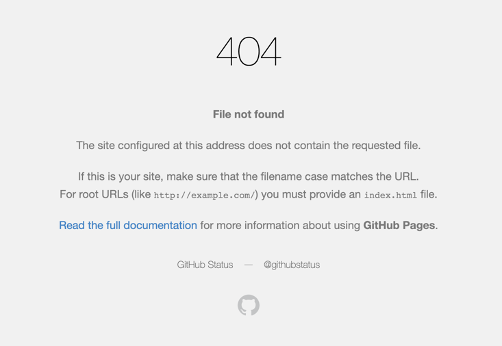

## Defect Report

**Issue**
 Broken Links

**Description:**
 Several links on the TodoMVC website lead to broken or non-existent pages, resulting in a poor user experience and potential frustration.

**Steps to Reproduce:**
 Launch the TodoMVC website.
 Navigate to various pages and sections of the website.
 Click on different links within the application, including navigation menus, buttons, and embedded links.
 Observe the destination of each clicked link.
 **The specific broken links are below:**
 https://todomvc.com/examples/humble
 https://todomvc.com/examples/somajs
 https://todomvc.com/examples/atmajs
 https://todomvc.com/examples/componentjs

**Expected Result:**
 All links within the TodoMVC website should lead to valid and relevant pages or sections of the application.

**Actual Result:**
 Multiple links lead to 404 error pages or redirect to unrelated or non-existent content.

**Severity:** Medium
 **Priority:** High

**Attachments:**
 

**Notes:**
 The presence of broken links negatively impacts the usability and credibility of the TodoMVC website. 
It is crucial to review and fix the links to ensure a smooth and consistent user experience throughout the application.
 Improper handling of error messages, debug information, or sensitive data in URLs can inadvertently expose internal 
system details or user-specific information, increasing the risk of information leakage or targeted attacks.

